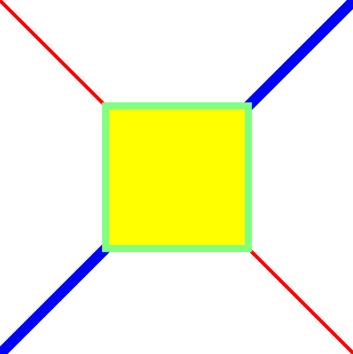

# tigerpy_drawing
Python Drawing Library

This is a Python library, which will enable clients to perform 2D drawing and then export it to SVG.

## Client Usage
```python
# client.py
from tigerpy_drawing import DrawingCanvas, Pen


black = (0, 0, 0)
red = (255, 0, 0)
blue = (0, 0, 255)
yellow = (255, 255, 0)
purple = (163, 73, 164) 
lightGreen = (128, 255, 128)
green = (34, 177, 76)

blackStrokeAndFillPen = Pen(1, black, black)
redThinPen = Pen(1, red)
blueThickPen = Pen(3, blue)
lightGreenStrokeYelloFillPen = Pen(2, lightGreen, yellow)
purpleStrokeGreenFillPen = Pen(1, purple, green)


# Create a drawing canvas
canvas = DrawingCanvas(300, 300)

# Draw few lines
canvas.SetPen(blackStrokeAndFillPen)
canvas.DrawText(10, 10, "Red 2 pixels thick line")
canvas.SetPen(redThinPen)
canvas.DrawLine(10, 15, 100, 15)

canvas.SetPen(blackStrokeAndFillPen)
canvas.DrawText(10, 35, "Blue 5 pixels thick line")
canvas.SetPen(blueThickPen)
canvas.DrawLine(10, 40, 100, 40)

# Draw Rectangle
canvas.SetPen(blackStrokeAndFillPen)
canvas.DrawText(10, 60, "Filled Rectangle")
canvas.SetPen(lightGreenStrokeYelloFillPen)
canvas.DrawRectangle(10, 65, 40, 40)

# Draw Circle and Ellipse
canvas.SetPen(blackStrokeAndFillPen)
canvas.DrawText(10, 120, "Circle and Ellipse")
canvas.SetPen(redThinPen)
canvas.DrawCircle(40, 160, 30)
canvas.SetPen(redThinPen)
canvas.DrawEllipse(100, 160, 20, 10)

# Draw Polyline
canvas.SetPen(blackStrokeAndFillPen)
canvas.DrawText(10, 220, "Polyline")
canvas.SetPen(redThinPen)
canvas.DrawPolyline([[10, 230], [15, 240], [20, 250], [30, 235], [40, 270]])

# Draw Polygon
canvas.SetPen(blackStrokeAndFillPen)
canvas.DrawText(160, 30, "Polygon")
canvas.SetPen(purpleStrokeGreenFillPen)
canvas.DrawPolygon([[220, 10], [300, 210], [170, 250], [123, 234]])

canvas.ExportSVG("temp.svg")
```

Run:
```
> python client.py
```

Output (screenshot of SVG file opened in Inkscape):


## TODOs
* Change font
* Transforms (translation, rotation, scaling)
* Bezier curves
* Export to other image formats: BMP, PNG, JPEG etc
* Draw arrows
* Draw N-gons (like hexagon, octagon etc)


